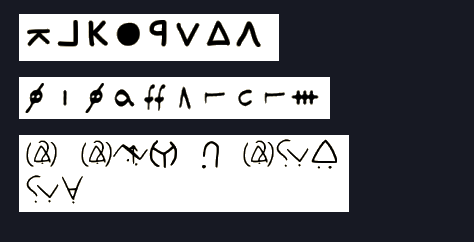

# Symbols
## Author : kn1gh7

### Description :
All three below ciphers have been used by serial killers and super villains

Find the hidden message

### Image :

### Solution :
A total of three different ciphers were used.
The first was the [Zodiac Killer Cipher](https://www.dcode.fr/zodiac-killer-cipher)

This decrypts to PASTEBIN

The second was the [Mary Stuart Code](https://www.dcode.fr/mary-stuart-code)

This decrypts to NINE C U D

The second was the [RataAlada Cipher](https://www.dcode.fr/rata-alada-cipher) from Batman

This decrypts to SSIXPSEVEN

On putting it all together it gives a [pastebin link](https://pastebin.com/9CUDS6P7) which gives the flag
TechnexCTF{symb0l_c1phers_k1ll_m3}
