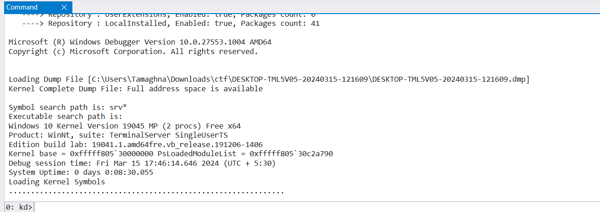

# System Info
## Author : kn1gh7

### Description :
This challenge is a part of series of challenges based on memory forensics. Solving it will unlock the next challenge

Chhota Bheem, the hero of Dholakpur village recently received a whatsapp message from Daaku Mangal Singh, an evil man who is constantly defeated by Bheem while trying to loot the village. The message was as follows
```text
Hello Bheem. I am Mangal Singh. 

This a friendship note. I am tired of getting defeated by you and have decided to do good things in life. I hope to be friends with you.

Kindly trust me and run the exe file. If you run the file I will get the message that you accept my friendship.
```
Bheem, owing to his good nature trusted the man and ran the file. However, it turned out to encrypt his important files. Help Bheem with this problem so he can save Dholakpur before Mangal Singh attacks.\
[MIRROR1](https://drive.google.com/file/d/1jsY7cOGJzWSLf58eBMwO6knkAJUSrKYQ/view?usp=sharing)

Find the operating system used by Bheem, along with the time the given dump was taken in UTC

FLAG FORMAT: TechnexCTF{Operatingsystem_DD-MM-YYYY_HH:MM:SS}\
There are only 20 attempts.

### Files :
Download it from [here](https://drive.google.com/file/d/1jsY7cOGJzWSLf58eBMwO6knkAJUSrKYQ/view?usp=sharing)

### Solution :
On extracting we get a dump file. On opening it using windbg we find\
\
From here we can see the Operating system is Windows10.\
The date is 15-03-2024 and time is 17:46:14.\
So we tried the flag TechnexCTF{Windows10_15-03-2024_17:46:14}.\
Oops wrong flag!!\
On taking a closer look at the chall we noticed the time was asked in UTC so we tried TechnexCTF{Windows10_15-03-2024_12:16:14}.\
Correct flag!!\
Flag : ```TechnexCTF{Windows10_15-03-2024_12:16:14}```
